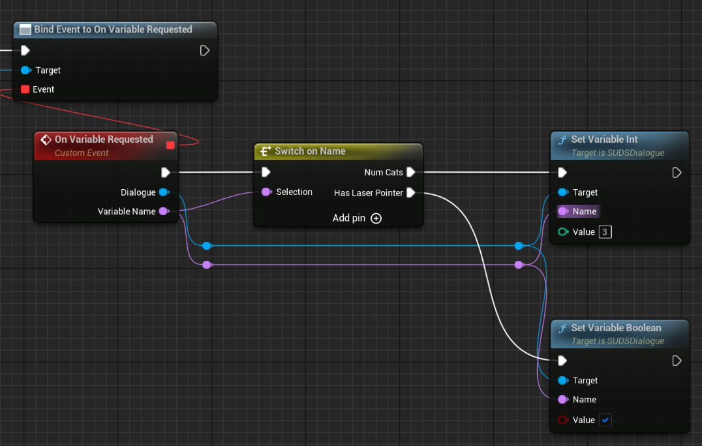

# Variables

Every [runtime instance](RunningDialogue.md) of a script (also called a Dialogue)
has a pool of variable memory, which is stored simply as a set of name/value pairs.

When you [set a variable](#setting-variables) value, either in script or in code, it 
is added to this variable memory, which persists all the time the dialogue exists, 
and can be [saved](SavingState.md).

* All variables are ***global***
* Variable names are ***case insensitive***.
* Variable names can contain:
	* Letters (a-z, A-Z)
	* Numbers (0-9)
	* Underscores (_)
	* Periods (.)

Variables are ***flexibly typed***, which means you can assign any of the 
[supported types](#supported-types) to them.

## Supported Types

| Type | Unreal Type | Notes |
|------|-------------|-------|
| Integer | int32 | Whole numbers between -2,147,483,648 and 2,147,483,647.|
| Float | float | Single-precision floating point numbers. Literals must contain a decimal point. |
| Boolean | bool | Literals can be `true` or `false`|
| Text | FText | Literal values are enclosed in double-quotes (`"Text"`) and are localised|
| Name | FName | Literal values are enclosed in backticks (`` `Name` ``), no localisation|
| Gender | ETextGender | Literals can be `masculine`, `feminine` or `neuter`


## Setting Variables

### Setting Variables In Script

This is done via [Set lines](SetLines.md).

### Setting Variables In Code

You set variables in code by calling one of the dialogue's `SetVariable` methods.

### Blueprints

Blueprints have a specific variant of `SetVariable` for each of the supported types,
for example: 


### C++

From C++ you can call these type-specific methods too, or you can call a
universal templated version which will determine the type automatically:

```c++
Dlg->SetVariable("NumCats", 3);
Dlg->SetVariable("HasLaserPointer", true);
```

### On-Demand Variable Setting

While the simplest way to get state from surrounding code into the dialogue 
is to do a one-time set fo calls to SetVariable at creation of
the dialogue, sometimes you might want to let the dialogue have access to state
on demand. Perhaps the state is volatile and changes during the dialogue.

To do this, you can hook into the `OnVariableRequested` event on the [runtime dialogue](RunningDialogue.md)
instance, or implement `OnDialogueVariableRequested` on a [Participant](Participants.md).

The event version might look something like this in Blueprints:



Or in C++ the Participant version might be:

```c++
void ANPC::OnDialogueVariableRequested_Implementation(USUDSDialogue* Dlg, FName VarName)
{
	static const FName NumCats("NumCats");
	static const FName HasLaserPointer("HasLaserPointer");
	if (VarName == NumCats)
	{
		Dlg->SetVariable(Numcats, 3);
	}
	else if (VarName == HasLaserPointer)
	{
		Dlg->SetVariable(HasLaserPointer, true);
	}
}
```

## Getting Variable Values

### Referencing in script

You can refer to the value of variables in many ways in the script.

In [Speaker](SpeakerLines.md) and [Choice](ChoiceLines.md) lines, you can substitute
[variables](Variables.md) into the text using curly braces, for example:

```yaml
NPC: Wow, look at that {Thing}!
```

See [Text Markup](TextMarkup.md) for more details.

You can also use them in [Expressions](Expressions.md) in both [Set lines](SetLines.md)
and [Conditional lines](ConditionalLines.md).

### Getting from Code

You can retrieve the value of any variable by calling one of the `GetVariable`
methods. Like `SetVariable` they have variants for each of the [supported types](#supported-types).

However if for some reason you do not know the type you can call the generic 
`GetVariable` and receive the flexible type version, which is of type `FSUDSValue`.

You can determine the type from that and retrieve the actual value, both in 
C++ and Blueprints, for example:


### Uninitialised Variables

If you reference the value of a variable which has not been set, you get a 
default value depending on the context. If you're doing a boolean test you get
false, if numeric you get 0, and for text you get a blank string.

---

### See Also
 
* [Set lines](SetLines.md)
* [Expressions](Expressions.md)
* [Saving State](SavingState.md)
* [Script Reference](ScriptReference.md)
* [Localisation](Localisation.md)
* [Running Dialogue](RunningDialogue.md)
* [Full Documentation Index](../Index.md)